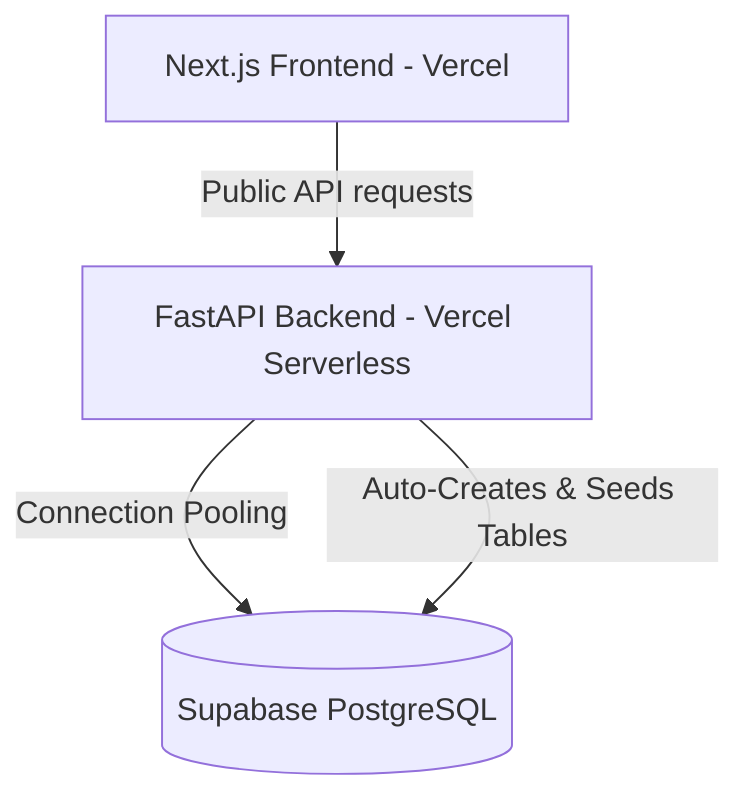

# Vercel & Supabase Production Deployment Guide

This guide outlines the production deployment architecture and steps for running the **GurucraftPro** platform entirely on Vercel (Frontend & Backend Serverless) utilizing Supabase (PostgreSQL) as the database. 

This modern stack is fully decoupled from Render and is optimized for low-latency, serverless connection pooling, and automatic database provisioning.

---

## 🏗️ Stack Architecture

---

## 🛠️ Step 1: Link Vercel to Supabase (Official Integration)

Instead of copying and pasting connection strings manually, use Vercel's official Supabase integration to connect your backend project to your Supabase project in one click.

1. In your **Vercel Dashboard**, open your **Backend Project** (`guru-craft-pro`).
2. Go to the **Integrations** tab ➡️ search for **Supabase**.
3. Click **Add Integration** and follow the prompts to link it to your Supabase project.
4. **Vercel will automatically inject these environment variables**:
   - `POSTGRES_URL` (Used by the backend to connect via Supabase's transaction pooler)
   - `POSTGRES_PRISMA_URL`
   - `POSTGRES_URL_NON_POOLING`
   - `POSTGRES_USER`
   - `POSTGRES_HOST`
   - `POSTGRES_PASSWORD`
   - `POSTGRES_DATABASE`

---

## 🔑 Step 2: Configure Environment Variables

Apply the following variables in the **Vercel Dashboard** under **Project Settings ➡️ Environment Variables**.

### 1. Backend Project Settings (`guru-craft-pro`)

> [!IMPORTANT]  
> If you have any old `DATABASE_URL` (Render DB) defined in your environment variables, **delete it**. The backend is pre-coded to automatically prioritize `DATABASE_URL`. Deleting it ensures it falls back to Vercel's automatically integrated Supabase `POSTGRES_URL`!

| Key | Value | Description |
| :--- | :--- | :--- |
| `JWT_SECRET_KEY` | `your-secure-long-random-string` | Used for admin JWT session generation. |
| `ADMIN_USERNAME_1` | `Annu_AD` | Your main admin username. |
| `ADMIN_PASSWORD_1` | `Annu_AD#05@1!2000` | Your main admin password. |
| `ADMIN_USERNAME_2` | `Om@Op` | Your backup admin username. |
| `ADMIN_PASSWORD_2` | `Oma628752#Op` | Your backup admin password. |

### 2. Frontend Project Settings (`guru-craft-frontend`)

| Key | Value | Description |
| :--- | :--- | :--- |
| `NEXT_PUBLIC_API_URL` | `https://guru-craft-pro.vercel.app` | Point this directly to your Vercel Backend URL! |

---

## 🔄 Step 3: Automatic Database Provisioning & Seeding

On Vercel Serverless, database setup and migration are **100% automated** on startup:
* **Table Creation**: On the first request cold-start, the backend automatically runs `Base.metadata.create_all(bind=engine)` to create all PostgreSQL tables on Supabase.
* **Content Seeding**: It automatically runs `SeedingService.run_all(db)` to seed all default dynamic pages (`Home`, `About`, `Services`, `Portfolio`, `FAQ`), establish roles/permissions, and seed your admin accounts with verified access permissions in Supabase!

---

## 🧪 Step 4: Health & Verification Checkpoints

1. **Verify Backend API**:
   * Open: **[https://guru-craft-pro.vercel.app/](https://guru-craft-pro.vercel.app/)**
   * Expected output: `{"message":"Welcome to GurucraftPro API","status":"online","documentation":"/docs","health":"/health"}`
2. **Verify CMS Page Retrieval**:
   * Open: **[https://guru-craft-pro.vercel.app/api/v1/cms/home](https://guru-craft-pro.vercel.app/api/v1/cms/home)**
   * Expected output: Full, rich JSON payload of your home page content from Supabase.
3. **Verify Frontend Live Site**:
   * Open your live frontend deployment URL. All sections will load flawlessly from your database without any timeouts!
